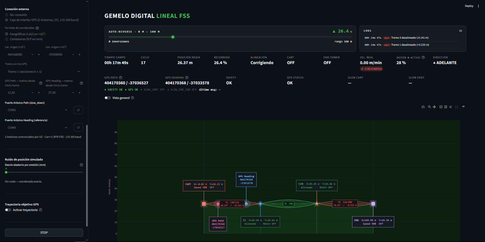
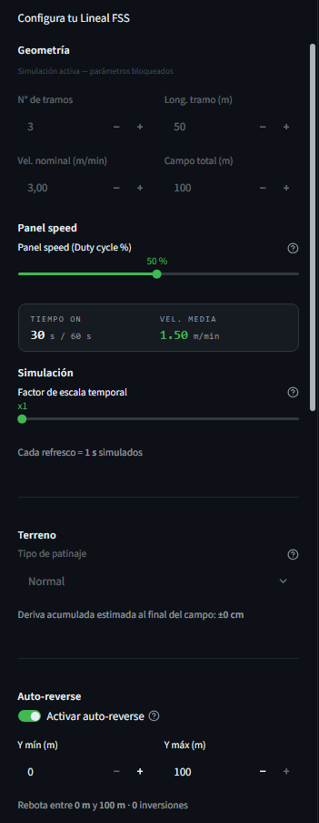
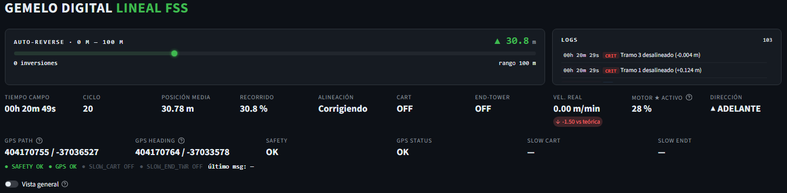
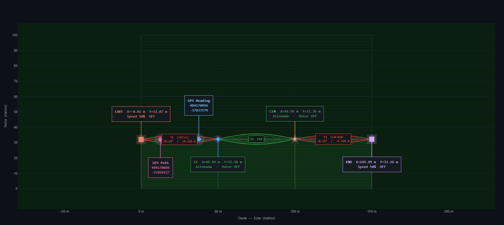
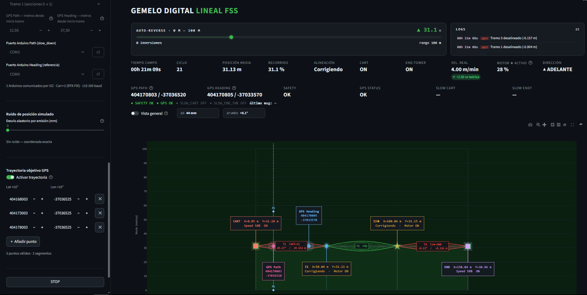

# Proyecto Digital Twins

> Simulador web en tiempo real del comportamiento de lineales de riego con guiado GPS.  
> Desarrollado en Python + Streamlit. 
> Primera implementación: **Lineal FSS**.

---

## Índice

1. [Por qué existe este proyecto](#por-qué-existe-este-proyecto)
2. [Cómo funciona](#cómo-funciona)
   - [Arquitectura de torres del Lineal FSS](#arquitectura-de-torres-del-lineal-fss)
   - [Duty cycle](#duty-cycle)
   - [Modo slow_down](#modo-slow_down)
   - [Simulación del terreno](#simulación-del-terreno)
3. [Arquitectura del código](#arquitectura-del-código)
4. [Manual de usuario](#manual-de-usuario)
   - [Primer vistazo a la interfaz](#primer-vistazo-a-la-interfaz)
   - [PASO 1. Configurar la geometría](#paso-1-configurar-la-geometría-del-lineal)
   - [PASO 2. Panel speed](#paso-2-configurar-la-velocidad)
   - [PASO 3. Terreno](#paso-3-configurar-el-terreno)
   - [PASO 4. Auto-reverse](#paso-4-auto-reverse)
   - [PASO 5. Conexión externa](#paso-5-conexión-externa)
   - [PASO 6. INICIAR](#paso-6-iniciar)
   - [El panel principal](#el-panel-principal-en-detalle)
   - [El mapa Plotly](#el-mapa-plotly)
   - [Controles](#controles-durante-la-simulación)
5. [Conexión con la caja de guiado Arduino](#conexión-con-la-caja-de-guiado-arduino)
   - [Configuración en la UI](#configuración-en-la-ui)
   - [Protocolo serie](#protocolo-serie)
   - [Ruido de posición simulado](#ruido-de-posición-simulado)
   - [Trayectoria objetivo GPS](#trayectoria-objetivo-gps)
6. [Multi-sesión. Operador y observador](#multi-sesión-operador-y-observador)
7. [Exportación CSV](#exportación-csv)
8. [Puesta en marcha](#puesta-en-marcha)
9. [Próximos pasos](#próximos-pasos)

---

## Por qué existe este proyecto

La caja de guiado GPS que se está desarrollando, necesita recibir coordenadas y devolver órdenes de ralentización en tiempo real. Probar ese algoritmo directamente en campo supone tener el lineal montado, el hardware listo y condiciones de operación reales: **costoso y lento**.

Este proyecto resuelve ese problema: simula el comportamiento físico del lineal segundo a segundo en una interfaz web. La caja de guiado se conecta por puerto serie igual que si estuviera en campo, sin saber que al otro lado hay una simulación. Puedes estresar el algoritmo, probar situaciones límite y validar el guiado antes de acercarte a la máquina real.

La arquitectura está diseñada como plataforma **digital_twins**: de momento solo está implementado el Lineal (FSS), pero el objetivo es ir añadiendo el Corner y el Pívot usando los mismos bloques de código.

---

## Cómo funciona

### Arquitectura de torres del Lineal FSS

Un lineal de riego tiene varios tramos. En los extremos hay dos torres especiales:

- **Cart:** torre extrema izquierda. Tiene motor propio con ciclo ON/OFF (duty cycle).
- **End-tower:** torre extrema derecha. Igual que el Cart, motor con duty cycle.
- **Torres intermedias:** no siguen un ciclo, sino que van corrigiendo su posición: cuando se quedan retrasadas respecto a la línea Cart–End-tower, arrancan su motor; cuando la alcanzan, lo paran. Factor de velocidad ×1.5 para que puedan recuperar el retraso.

El **FSS (Free Standing Span):** es el tramo central rígido, con dos motores propios:
- Motor izquierdo: factor ×1.5 (igual que el resto de intermedias).
- **Motor rápido**: factor ×2.0 (el más rápido de todo el lineal).

El FSS mantiene sus dos torres flanqueantes alineadas rígidamente con el eje Cart–End-tower tras cada tick de simulación.

### Duty cycle

Cart y End-tower avanzan a ráfagas. Cada ciclo dura 60 segundos. Si la velocidad de panel está al 50 %, el motor estará ON durante 30 s y OFF durante 30 s. Al 70 %, ON 42 s / OFF 18 s. Este es el mecanismo real de los lineales comerciales.

### Modo slow_down

Cuando la caja de guiado detecta que el lineal se desvía de la trayectoria, manda una señal `SLOW_DOWN_CART_ON` o `SLOW_DOWN_END_TOWER_ON` por puerto serie. Eso hace que la guía ralentizada **deje de seguir su duty cycle propio** y copie en su lugar el ON/OFF del motor rápido (★). Como el motor rápido va al doble de velocidad, el lado contrario avanza más, girando el conjunto progresivamente.

Cuando la corrección está hecha, la caja manda `SLOW_DOWN_*_OFF` y la guía vuelve a su ritmo normal.

### Simulación del terreno

Las torres Cart y End-tower acumulan una pequeña deriva lateral aleatoria (ruido gaussiano proporcional al nivel de terreno configurado). Esto modela el patinaje real de las ruedas sobre el campo: incluso con el motor ON, el avance no es perfectamente recto.

---

## Arquitectura del código

```
digital_twins/
  ├── app.py               # Punto de entrada Streamlit
  ├── modelos/
  │   ├── componentes.py   # Bloques reutilizables (TramoFinal, TramoIntermedio, FSS, GPS, Caja)
  │   └── lineal.py        # Clase Lineal: ensambla los componentes, orquesta la simulación
  ├── logica/
  │   ├── estado.py        # Estado global compartido entre sesiones (@st.cache_resource)
  │   ├── constantes.py    # Presets de terreno y valores por defecto de simulación
  │   └── trayectoria.py   # Parsing de puntos GPS y cálculo de error distancia/rumbo
  └── ui/
      ├── figura.py        # Figura Plotly del campo (torres, tramos, GPS, trayectoria)
      ├── panel.py         # Panel principal: métricas, logs, mapa (fragmento de 1 s)
      ├── sidebar.py       # Sidebar: configuración y botones de control
      └── estilos.py       # CSS global de la aplicación
```

### `componentes.py` 
Contiene las clases base reutilizables para cualquier máquina que se quiera simular:

| Clase | Qué representa |
|---|---|
| `TramoFinal` | Torre extrema (Cart o End-tower). Avanza por duty cycle y soporta modo slow_down. |
| `TramoIntermedio` | Torre intermedia. Sigue la diagonal Cart–End-tower. Motor ON al retrasarse, OFF al alcanzar. |
| `FreeStandingSpan` | Tramo central rígido con dos motores propios (×1.5 y ×2.0). Tras cada tick recoloca sus torres. |
| `AntenaGPS` | Posición simulada de una antena GPS en un punto del tramo. Calcula lat/lon en tiempo real. |
| `CajaInterfaz` | Hilo serie con los dos Arduinos: envía coordenadas cada segundo, recibe mensajes de guiado. |

### `lineal.py`

`Lineal` construye la máquina a partir de los componentes y expone tres operaciones principales:

- **`avanza(segundos)`**: avanza la simulación `n` segundos. Aplica duty cycle a Cart y End-tower, hace avanzar en cascada las torres intermedias desde ambos extremos hacia el FSS, y el FSS recoloca sus torres.
- **`start() / stop()`**: arranca o para la simulación.
- **`asignar_caja(...)`**: monta las dos antenas GPS en un tramo y abre los puertos serie.

### `logica/estado.py` — Estado compartido entre sesiones

Usa `@st.cache_resource` para crear un único `SimState` para todo el proceso Streamlit. Todas las sesiones abiertas en el navegador (operador + observadores) ven exactamente el mismo estado. `SimState` es un diccionario con acceso por atributo (`sim.en_marcha`, `sim.lineal`, etc.).

### `ui/panel.py`

El panel principal usa `@st.fragment(run_every=1)`, que lo hace refrescar cada segundo independientemente del resto de la página. En cada refresco:

1. Si la sesión es la del operador, avanza la simulación un tick.
2. Actualiza la barra de progreso y los logs.
3. Recalcula y muestra métricas y figura Plotly.

---

## Manual de usuario

### Primer vistazo a la interfaz



La pantalla se divide en dos zonas:

- **Sidebar izquierdo:** configuración del lineal y botones de control.
- **Panel principal:** visualización en tiempo real: barra de progreso, logs, métricas y mapa.

---

### PASO 1. Configurar la geometría del lineal

En el sidebar, bajo **Geometría**:

| Campo | Qué define |
|---|---|
| N° de tramos | Cuántos tramos tiene el lineal (mínimo 3, para que exista el FSS). |
| Long. tramo (m) | Longitud de cada tramo en metros. Todos los tramos son iguales. |
| Vel. nominal (m/min) | Velocidad máxima teórica del lineal a plena potencia (panel speed 100 %). |
| Campo total (m) | Longitud del campo en metros. Marca el fin del recorrido. |

> Estos parámetros quedan bloqueados una vez iniciada la simulación.

---

### PASO 2. Configurar la velocidad

El slider **Panel speed** ajusta el duty cycle de Cart y End-tower entre 1 % y 100 %.  
Debajo del slider se muestra en tiempo real:
- **Tiempo ON**: cuántos segundos de cada ciclo de 60 s estará el motor encendido.
- **Vel. media**: la velocidad resultante en m/min a esa configuración.

> El panel speed se puede cambiar en cualquier momento durante la simulación.

---

### PASO 3. Configurar el terreno

Bajo **Terreno**, selecciona el nivel de patinaje que modela las irregularidades del suelo:

| Nivel | Efecto |
|---|---|
| Perfecto (sin ruido) | Avance perfectamente recto. Solo para pruebas ideales. |
| Poco | Deriva mínima. Campo bien preparado. |
| Normal | Patinaje típico de campo real. |
| Irregular | Suelo con desniveles o regueros. |
| Lineal loco | Patinaje máximo. Para ver cómo responde el guiado bajo condiciones extremas. |

---

### PASO 4. Auto-reverse

Activa **Auto-reverse** si quieres que el lineal rebote automáticamente entre dos límites norte/sur en lugar de detenerse al llegar al final del campo. Útil para simular un riego completo de varias pasadas.

---

### PASO 5. Conexión externa

Si quieres conectar la caja de guiado real por puerto serie, selecciona **Caja de interfaz GPS** en *Conexión externa*.

Aparecerán los parámetros de configuración de la caja (explicados en detalle en la sección [Conexión con la caja de guiado Arduino](#conexión-con-la-caja-de-guiado-arduino)).

---

### PASO 6. INICIAR

Pulsa **INICIAR** en la parte inferior del sidebar. La simulación arranca, los parámetros de geometría se bloquean y el panel empieza a refrescarse cada segundo.



---

### El panel principal en detalle



**Barra de progreso** (zona superior izquierda):
- Modo normal: muestra el % del campo recorrido y los metros avanzados.
- Modo auto-reverse: muestra posición actual, dirección (▲ / ▼) y número de inversiones.

**Logs** (zona superior derecha, misma altura que la barra):
- Historial de eventos en tiempo real: START, STOP, desalineamientos de tramos, cambios de slow_down, safety/GPS fail.
- Sin límite de entradas en memoria. Se muestran las 500 más recientes.

**Métricas** (fila debajo de la barra):

| Métrica | Qué muestra |
|---|---|
| Tiempo campo | Tiempo simulado transcurrido (hh mm ss). |
| Ciclo | Número de ciclo de 60 s completados. |
| Posición media | Posición norte promedio de todas las secciones (metros). |
| Recorrido | % del campo recorrido. |
| Alineación | OK si todos los tramos están dentro de tolerancia / Corrigiendo si alguno se ha desviado. |
| Cart / End-tower | Estado del motor (ON / OFF). Si están en slow_down aparece ★ junto al estado. |
| Vel. real | Velocidad media real medida tick a tick. Delta respecto a la velocidad teórica. |
| Motor ★ activo | % del último ciclo que el motor rápido (FSS) estuvo encendido. |
| Dirección | ▲ ADELANTE / ▼ ATRÁS. |

Si hay caja de guiado conectada, aparece una segunda fila de métricas con coordenadas GPS, estado de Safety, GPS OK, y slow_down de Cart y End-tower en tiempo real.

---

### El mapa Plotly



El mapa muestra una vista cenital del campo. Puedes hacer zoom y desplazarte libremente.

**Torres:**

| Color y forma | Torre |
|---|---|
| Rojo cuadrado | CART (extremo izquierdo) |
| Morado cuadrado | END-tower (extremo derecho) |
| Naranja estrella ★ | Torre con el motor rápido (FSS derecho) |
| Azul círculo | Torres intermedias del lado izquierdo |
| Verde círculo | Torres intermedias del lado derecho |

El borde del marcador cambia de color según el estado del contactor: verde si el motor está ON, gris si está OFF.

**Tramos:**

Cada tramo se dibuja Y el color indica el estado de alineación:

| Color | Estado |
|---|---|
| Verde | Alineado y recto — dentro de tolerancia (< 5 cm de desviación). |
| Amarillo | Alineado pero con ligera desviación angular. |
| Rojo | Desalineado — el motor de la torre intermedia está corrigiendo. |

> El tramo FSS se dibuja más ancho que el resto para reflejar su mayor rigidez estructural.

**Rastros de posición:** líneas finas de colores que muestran la trayectoria histórica de cada sección desde el inicio de la simulación.

**Trayectoria GPS objetivo:** línea discontinua azul que une los waypoints definidos, con marcadores de diamante en cada punto.

**Antenas GPS:** si hay caja conectada, aparecen dos marcadores de cruz con halo:
- Rosa: antena **Path** (la que controla el guiado).
- Azul claro: antena **Heading** (referencia de orientación).

Al pasar el cursor sobre cada torre o tramo aparece un tooltip con información detallada de posición, ángulo y estado del motor.

---

### Controles durante la simulación

| Botón | Cuándo aparece | Qué hace |
|---|---|---|
| **STOP** | Simulación en marcha | Para el lineal. Desconecta la caja GPS si estaba activa. Resetea flags slow_down. |
| **CONTINUAR** | Simulación pausada | Reanuda el lineal y reconecta la caja GPS. Bloqueado si hay SAFETY FAIL o GPS FAIL activos. |
| **RESET** | Simulación pausada | Vuelve al estado inicial: borra el modelo, los logs y los rastros. |
| **REINICIAR** | Simulación completada | Igual que RESET. |

El **factor de escala temporal** (sidebar, sección Simulación) controla cuántos segundos de simulación avanza el modelo entre cada refresco. A ×60 (valor por defecto), cada segundo real equivale a un minuto simulado.

---

## Conexión con la caja de guiado Arduino

La caja de guiado está compuesta por dos Arduinos comunicados entre sí por I2C:
- **Arduino Path:** recibe las coordenadas de la antena de guiado y devuelve las señales de slow_down al gemelo.
- **Arduino Heading:** recibe las coordenadas de la antena de referencia de orientación.

### Configuración en la UI

Bajo **Conexión externa → Caja de interfaz GPS**:

| Parámetro | Descripción |
|---|---|
| **Formato de coordenadas** | *Geográficas (Lat/Lon ×10⁷)*: protocolo GPS estándar. *Cartesianas (X/Y en mm)*: coordenadas locales del campo. |
| **Lat. / Lon. origen** | Coordenadas del punto (0, 0) del campo en formato ×10⁷. Solo aplica en modo geográfico. |
| **Tramo con los GPS** | El tramo del lineal donde están montadas físicamente las dos antenas. |
| **GPS Path (metros desde inicio tramo)** | Distancia desde el extremo izquierdo del tramo donde está la antena de guiado. |
| **GPS Heading (metros desde inicio tramo)** | Distancia desde el extremo izquierdo del tramo donde está la antena de referencia. |
| **Puerto Arduino Path** | Puerto COM del Arduino que controla el guiado (recibe slow_down). |
| **Puerto Arduino Heading** | Puerto COM del Arduino de referencia de orientación. |

> El botón ↺ junto a cada selector refresca la lista de puertos disponibles.

### Protocolo serie

La comunicación corre a 115 200 baudios. El gemelo envía una trama por segundo a cada Arduino:

**Modo geográfico:**
```
Lat 404168523 Lon -37038120 Carr 2
```

**Modo cartesiano:**
```
X 12340 Y -5670 Carr 2
```

`Carr 2` indica modo RTK FIX (el único que acepta el algoritmo de guiado).

El Arduino Path puede responder con cualquiera de estas señales:

| Mensaje | Efecto en la simulación |
|---|---|
| `SLOW_DOWN_CART_ON` | El Cart copia el ritmo del motor rápido. El lineal gira hacia la izquierda. |
| `SLOW_DOWN_CART_OFF` | El Cart vuelve a su duty cycle normal. |
| `SLOW_DOWN_END_TOWER_ON` | El End-tower copia el ritmo del motor rápido. El lineal gira hacia la derecha. |
| `SLOW_DOWN_END_TOWER_OFF` | El End-tower vuelve a su duty cycle normal. |
| `SAFETY_OK` / `SAFETY_FAIL` | Actualiza el estado de seguridad. SAFETY_FAIL detiene el lineal y bloquea CONTINUAR hasta que se resuelva. |
| `GPS_OK` / `GPS_FAIL` | Actualiza el estado GPS. GPS_FAIL pausa automáticamente. GPS_OK reanuda automáticamente si la pausa fue por esta causa. |

### Ruido de posición simulado

El slider **Desvío aleatorio por emisión** añade hasta ±15 mm de error aleatorio a cada coordenada antes de enviarla al Arduino. Sirve para simular la imprecisión real de una antena RTK y ver cómo responde el algoritmo de guiado bajo ruido.

### Trayectoria objetivo GPS

Bajo **Trayectoria objetivo GPS** puedes definir una ruta de waypoints en formato Lat/Lon ×10⁷. El gemelo:

1. Dibuja la trayectoria como línea discontinua azul en el mapa.
2. Calcula segundo a segundo:
   - **Error de distancia (mm)**: distancia perpendicular entre la antena Path y el segmento de trayectoria más cercano.
   - **Error de rumbo (°)**: diferencia entre el azimut actual del lineal y el azimut objetivo del segmento.
3. Muestra ambos errores como chips en la barra de herramientas del panel.



> Estos errores son los mismos valores que el algoritmo de guiado real está minimizando, lo que permite validar directamente su comportamiento.

---

## Multi-sesión. Operador y observador

La aplicación soporta múltiples pestañas o equipos conectados simultáneamente al mismo proceso Streamlit:

- **La primera sesión que pulsa INICIAR** se convierte en el **operador**: tiene acceso a todos los controles y es quien avanza la simulación segundo a segundo.
- **El resto de sesiones** son **observadores**: ven el estado en tiempo real (posición, métricas, mapa, logs) pero no pueden modificar nada. Su sidebar muestra el resumen del lineal activo, el estado de la conexión GPS y los errores de trayectoria si están disponibles.

Esta separación permite, por ejemplo, que el equipo de firmware esté mirando la simulación desde sus equipos mientras el que coordina la prueba controla la simulación desde el suyo.

---

## Exportación CSV

Al finalizar la simulación (o al pausarla), si hay datos, aparece un botón **⬇ CSV** en el panel. El archivo contiene una fila por cada tick simulado con:

- Tiempo (segundos y formato hh mm ss).
- Posición norte media.
- Estado de slow_down (cart y end-tower).
- Posición X/Y de cada sección del lineal.
- Por cada tramo: longitud real, deformación respecto a longitud nominal, desviación norte y ángulo.
- Coordenadas GPS de las antenas Path y Heading (lat/lon ×10⁷).
- Error de distancia (mm) y de rumbo (°) respecto a la trayectoria objetivo.

Los archivos se guardan automáticamente en la carpeta `exports/` durante la simulación con el nombre `simulacion_YYYYMMDD_HHMMSS.csv`.

---

## Puesta en marcha

### Requisitos

```
Python 3.11+
streamlit>=1.55
plotly>=5
pyserial       # solo si se conecta la caja de guiado
```

### Instalación

```bash
pip install -r requirements.txt
```

### Arrancar la aplicación

Desde la raíz del repositorio:

```bash
streamlit run app.py
```

La aplicación abre en `http://localhost:8501`. Cualquier equipo en la misma red puede acceder como observador abriendo esa dirección.

---

## Próximos pasos

El selector de tipo de sistema en el sidebar ya incluye **Pívot** y **Corner**, reservados para las próximas implementaciones. La arquitectura de `componentes.py` está pensada para que añadir un nuevo tipo de máquina sea cuestión de crear una nueva clase que use los mismos bloques (TramoFinal, TramoIntermedio, AntenaGPS, CajaInterfaz) sin tocar lo que ya funciona.

El Corner es el siguiente en la lista, en paralelo con el desarrollo del firmware de guiado GPS para esa configuración.
